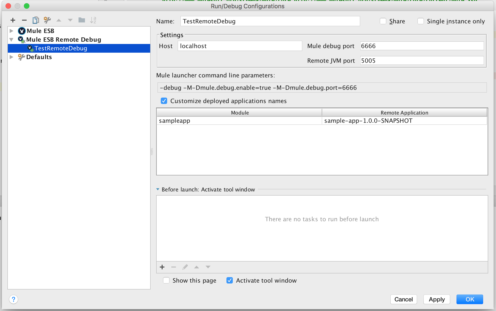

# Mule Runtime plugin for IntelliJ IDEA
**version 0.12**

[Features](#features)

[Pre-requisites](#pre-requisites)

[Installation](#installation)

[Creating Mule applications](#creating-mule-applications)

[Creating Mule application components](#creating-mule-application-components)

[Run/Debug configurations](#rundebug-configurations)

[Remote Mule instance debugging](#remote-mule-instance-debugging)

[Encrypting and decrypting properties](#encrypting-and-decrypting-properties)

[APIKit scaffolding](#apikit-scaffolding)

[Live templates](#live-templates)

## Features
- Supports Mule Runtime versions 3.7 to 3.8.x
- Supports Mule Domain projects
- Multiple applications can be launched in a single Run Configuration
- Properties encryption and decryption
- Mule configuration XML files debugger
- Support for remote debugging of a standalone Mule instance
- APIKit and APIKit SOAP scaffolding
- Pre-defined live templates for common Mule elements and expressions
- File types for DataWeave, MEL, RAML, Mule and MUnit
- Syntax highlighting and auto completion for Mule application components (XML config, DataWeave, MEL, RAML)

## Pre-requisites
- IntelliJ IDEA Community Edition version 2016 or later
- Oracle JDK (not JRE!) version 1.8 or later
- Apache Maven 3.3+

## Installation
To download and install Mule Runtime plugin:
1. Open the IntelliJ **Settings** dialog
2. In the left-hand pane, select **Plugins**
3. Click the **Browse Repositories...** button
4. Search for **Mule ESB plugin** and click the **Install** button

> NOTE: this will also install two other plugins from the suite, the **[DataWeave plugin](https://github.com/machaval/mule-intellij-plugins/tree/master/data-weave-plugin)** and the **[RAML plugin](https://github.com/machaval/mule-intellij-plugins/tree/master/raml-plugin)**.

## Creating Mule applications
1. If no project is currently open in IntelliJ IDEA, click **Create New Project** on the Welcome screen. Otherwise, select **File | New | Project**.
As a result, the New Project wizard opens.

2. Select the **Mule Application** project category in the left pane of the New Project window.
3. Select the Mule Runtime version from the drop-down menu. If the list is empty, or the required version is missing, click the **New...** button and the **Mule SDK** dialog appears.
   1. If there is an existing Mule Runtime installation, click the **+** button and navigate to the directory where Mule is installed (i.e. the *MULE_HOME*)
   2. If there are no Mule Runtimes installed, click the **Download a version** button and select Mule Runtime version to download and the installation directory.

    

4. Follow the prompts on the next wizard screens to set the artifact ID, group ID, version and project location.

## Creating Mule application components
1. Right-click on a folder in the **Project** view and select **New | Mule Component** in the context menu, or select **File | New | Mule Component** in the main menu.
2. Enter the new component name and select one of the following options in the drop-down menu:
- Mule Configuration
- MUnit Test
- DataWeave
- MEL Script
- RAML File

## Run/Debug configurations
To create a new Run/Debug configuration, select **Run | Edit configurations...**, or select the **Edit configurations** option in the toolbar menu.

In the new Run/Debug Configuration dialog click the **+** button to add new configuration and select the **Mule ESB** option.

Set the name for the new configuration, select modules to be deployed, select the runtime version and optionally set the additional VM arguments. Click **OK** to save the new configuration.

## Remote Mule instance debugging

To debug a remote Mule instance, select **Run | Edit configurations...**, or select the **Edit configurations** option in the toolbar menu, click the **+** button to add new configuration and select the **Mule ESB Remote Debug** option.

Set the name for the new configuration and change the host and port where the Mule container is running. Right below the host and port there's a list of additional command line parameters that must be passed to the Mule instance. See the **[Starting Mule Server In Debug Mode](https://docs.mulesoft.com/anypoint-studio/v/6/studio-visual-debugger#debugging-remotely)** section of the MuleSoft Anypoint Platform documentation for more details.

## Encrypting and decrypting properties

To encrypt a property, open the `.properties` file and either a) right-click on the property name, or b) open the **Structure** view and right-click on the property name.

Select the **Encrypt...** menu option and in the Encryption dialog set the encryption password, algorithm and mode.

## APIKit scaffolding

Right-click on the RAML file in the Project view. The XML file with the same name will be created automatically in the `src/main/api` directory. If the file already exists, it will be overwritten,

APIKit SOAP scaffolding is done in a similar way, when the context menu is opened on the WSDL file.

## Live templates

| Template | Value |Notes|
|:---------|-------|-----|
|**flow**|`<flow name="."></flow>`|Creates new flow|
|**flowref**|`<flow-ref name=""/>`|Creates reference to an existing flow|
|**httpl**|`<http:listener config-ref="" path=""/>`|HTTP listener|
|**httplc**|`<http:listener-config name="" host="" port=""/>`|Global HTTP listener config|
|**httpr**|`<http:request config-ref="" path="" method="GET"/>`|HTTP request|
|**httprc**|`<http:request-config name="" host="" port=""/>`|Global HTTP request config|
|**logp**|`<logger message="Payload = #[payload]"/>`|Logger|
|**logps**|`<logger message="String Payload = #[message.payloadAs(java.lang.String)]"/>`|Logs message as a string|
|**mns**|`xmlns:="http://www.mulesoft.org/schema/mule/"`|Template for namespace prefix declaration|
|**msl**|`http://www.mulesoft.org/schema/mule/ http://www.mulesoft.org/schema/mule//current/mule-.xsd`|Template for schema location|

